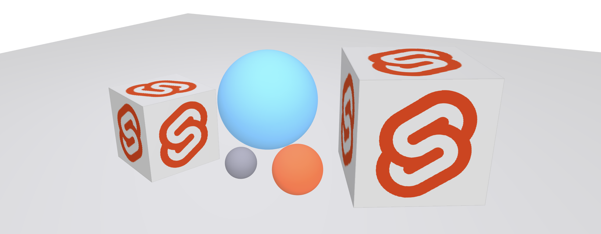

# @sveltejs/gl

Declarative WebGL scene graphs inside [Svelte](https://svelte.dev).

## Here be dragons

This is not even *close* to production-ready. It's missing many essential features, and isn't optimised. The API is certain to change in substantial ways. You have been warned.

If you're not fazed by that sort of thing, and would like to help figure out how to make this all work, contributions are very welcome.

## Why are you doing this?

Someone once described the DOM as 'an API that only a mother could love'. Clearly that person had never tried to build anything with WebGL. Hand-written WebGL code is *phenomenally* ugly and confusing.

Because of that, people typically reach for libraries like [Three.js](https://threejs.org/) and [regl](http://regl.party/). I use and love both, but they each have characteristics that make them unsuitable for certain tasks:

* Three is comfortably over half a megabyte minified, making it less than idea for *casual* or *whimsical* graphics — especially on low-powered devices where your JS budget is small. Typically, when you encounter Three in the wild, it's used for a standalone set-piece interactive
* regl is intentionally low-level. I've found it to be difficult to use for quickly iterating on an idea, because you're thinking in terms of *draw calls* rather than a *scene graph*

Meanwhile, [A-Frame](https://aframe.io/) — which is a web component wrapper around Three — has demonstrated that a declarative markup-driven approach provides a great authoring experience, particularly for certain kinds of scenes. Since it builds on top of Three, it inherits its strengths and weaknesses.

@sveltejs/gl is several things:

* An experiment to test a hypothesis that building scene graphs 'the Svelte way' is satisfying and productive, and needn't cost much in terms of JavaScript
* A way to figure out what the right APIs are
* A test to see how much of this can be built in Svelte already (and still perform well) without needing to extend the compiler
* A thing I need at work

## How can I use it?

Check out [this demo](https://svelte-gl-demo.surge.sh) to get started. There's not much point writing docs until things are a bit more settled.

## Ideas for future development

Some of these may be a bit pie-in-the-sky:

* Post-processing
* Scene graph editor
* WebVR (this would require Svelte to be able to use the VR display's `requestAnimationFrame` instead of the default one, since the refresh rate on VR devices can be 90 or 120fps)
* Interactivity (i.e. raycasting)
* Physics
* Interleaving DOM and GL content (i.e. part of the scene renders behind the DOM, some in front)
* What's the analog of server-side rendering for a GL scene — precomputing high fidelity global illumination maps etc?

## License

MIT
